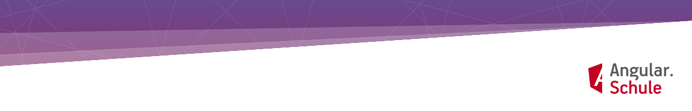

## Herzlich Willkommen bei der Angular.Schule!
Wir machen Sie und Ihr Team fit für das Webframework **Angular** – in offenen Gruppen oder individuellen Inhouse-Schulungen. Von den Buchautoren und Google Developer Experts (GDE) **Johannes Hoppe** und **Ferdinand Malcher**.

### 📅 Nächster Termin

**Online-Intensivworkshop Angular** 
9.-16. Februar 2022 (6 Tage) 
Tickets und Infos: https://angular.schule/online